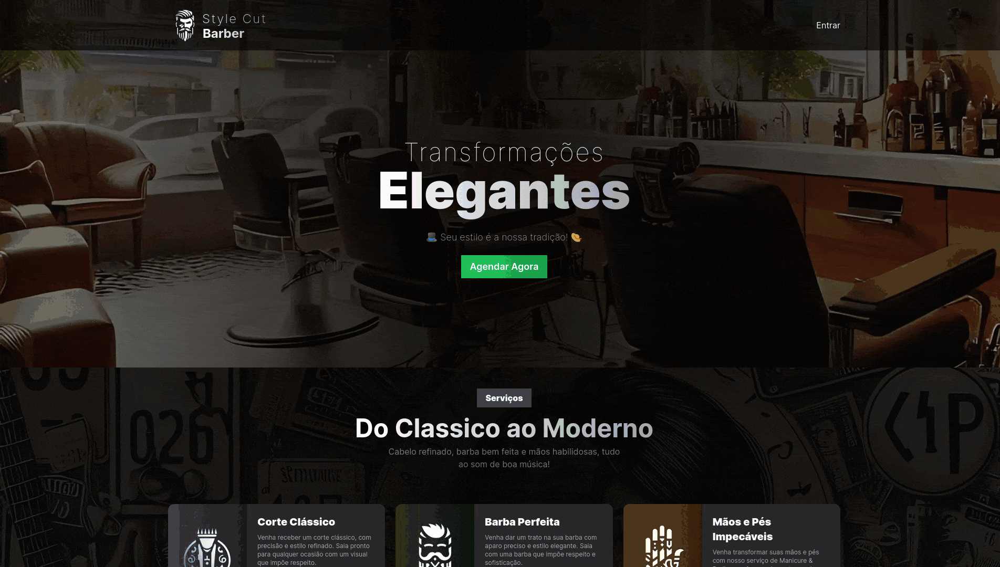
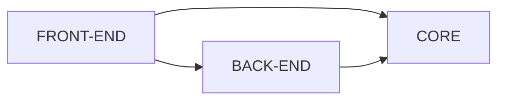

<div .element: style="display: flex; align-items: center; justify-content: center; background: #363535; padding-left: 10px; margin-bottom: 30px;">
  
  <h1 style="color: #fff">Style Cut Barber</h1>  
</div>

Bem-vindo ao repositório do **Sistema de Agendamentos para Barbearia!** Este projeto foi desenvolvido para fornecer uma solução eficiente e moderna para o gerenciamento de agendamentos em uma barbearia. Utilizei várias tecnologias e práticas de desenvolvimento para criar uma aplicação robusta e escalável.



## 💻 Tecnologias utilizadas

### Turborepo
Este projeto utiliza o Turborepo para gerenciar múltiplos pacotes em um único repositório, permitindo um desenvolvimento mais organizado e facilitando a manutenção.

### Frontend com Next.js e Tailwind
- **Next.js:** Um framework React para desenvolvimento de aplicações web com renderização do lado do servidor (SSR) e geração de sites estáticos (SSG).
- **Tailwind CSS:** Um framework CSS utilitário para criação rápida de interfaces de usuário com estilos pré-definidos e altamente personalizáveis.

### Backend com NestJS (API Rest)
- **NestJS:** Um framework Node.js progressivo para a construção de aplicações server-side eficientes, escaláveis e de fácil manutenção.

### Banco de Dados PostgreSQL
- **PostgreSQL:** Um banco de dados relacional poderoso e open-source, utilizado para armazenar de forma segura e eficiente todos os dados da aplicação.

### Docker
- Uma plataforma para desenvolvimento, envio e execução de aplicações em contêineres. Utilizei o Docker para configurar e gerenciar o ambiente do PostgreSQL.

### Prisma ORM
- Um ORM moderno que facilita a interação com o banco de dados, proporcionando uma experiência de desenvolvimento mais produtiva e segura.

## 🏛️ Arquitetura do Projeto
A arquitetura do projeto foi cuidadosamente planejada para promover a separação de preocupações e facilitar a manutenção e escalabilidade.

### Abstração das Regras de Negócio
As regras de negócio (core do projeto) foram abstraídas em uma camada separada, permitindo que a lógica de negócio seja isolada da camada de apresentação e persistência.

### Princípios de SOLID
- Inversão de Dependência: As dependências do projeto são invertidas para promover um código mais modular e de fácil manutenção.
- Injeção de Dependência: Utilizado a injeção de dependência para gerenciar as dependências entre os componentes da aplicação, promovendo a reutilização e flexibilidade do código.

### Repository Pattern
Implementei o design pattern de repositório para isolar a lógica de acesso a dados, promovendo uma camada de abstração entre a aplicação e a persistência dos dados. Isso facilita a manutenção e a troca do mecanismo de persistência, se necessário.

### Use Cases e Clean Architecture
Adotei o padrão de casos de uso, alinhado com os princípios da Clean Architecture, para organizar a lógica de negócio da aplicação. Cada caso de uso representa uma ação específica que o sistema pode executar, garantindo que a lógica de negócio esteja bem definida e separada das outras camadas.

## ⚙️ Instalação e Configuração
1. Clone este repositório:
    ```sh
      git clone https://github.com/seu-usuario/seu-repositorio.git
    ```
2. Navegue até o diretório do projeto:
    ```sh
      cd seu-diretorio/seu-repositorio
    ```
3. Instale as dependências:
    ```sh
      yarn install
    ```
4. Configure as variáveis de ambiente no arquivo `.env` utilizando como exemplo o arquivo `.env.example` (no frontend e backend)

5. Inicie os serviços Docker (você precisa ter o Docker instalado em sua maquina):
    ```sh
      docker-compose up -d
    ```
6. Execute as migrations do Prisma para criar as tabelas no banco de dados:
    ```sh
      npx prisma migrate dev
    ```
7. Execute o seeder para inserir dados dos profissionais no banco:
    ```sh
      npx prisma db seed
    ```
8. Crie um build dos apps e do package core (o NestJS depende disso para usar o Core):
    ```sh
      yarn build
    ```
9. Inicie a aplicação:
    ```sh
      yarn run dev
    ```
10. Você poderá acessar a aplicação em: http://localhost:3000

## 🗂️ Estrutura do projeto



## 📑 Documentação API

**scheduling-api** Agendamento
<div style="font-family: Arial, sans-serif; margin: 20px; padding: 20px; border: 1px solid #e5e5e5; border-radius: 5px;">
  <div style="display: flex; justify-content: space-between; align-items: center; background-color: #f2f2f2; padding: 10px; border: 2px solid #55C546; border-radius: 8px;">
    <div style="display: flex; align-items: center;">
      <span style="background-color: #55C546; color: white; padding: 5px 10px; border-radius: 3px; font-size: 14px; margin-right: 10px;">POST</span>
      <span style="font-size: 16px; font-weight: bold;">/schedules</span>
    </div>
    <span >Criar novo agendamento.</span>
  </div>    
    <pre>
    <b>Parameters</b> <i>(path)</i>
      -
    <b>Parameters</b> <i>(query)</i>
      -
    <b>Request body</b>
      <code class="language-js">
        {
          "customerEmail: "string",
          "date": "Date",
          "professional": "string",
          "services": "string[]",
        }
      </code>
    <b>Response</b>
      <code class="language-js">
        {
          "id": "string",
          "customerEmail: "string",
          "date": "Date",
          "professional": "string",
          "services": "string[]",
        }
      </code>
    </pre>
    <div style="display: flex; justify-content: space-between; align-items: center; background-color: #f2f2f2; padding: 10px; border: 2px solid #61affe; border-radius: 8px;">
    <div style="display: flex; align-items: center;">
      <span style="background-color: #61affe; color: white; padding: 5px 10px; border-radius: 3px; font-size: 14px; margin-right: 10px;">GET</span>
      <span style="font-size: 16px; font-weight: bold;">/schedules/busy/:professional_id/:date</span>
    </div>
    <span>Obter horários ocupados.</span>
  </div>    
    <pre>
    <b>Parameters</b> <i>(path)</i>
      professional_id: string
      date: Date
    <b>Parameters</b> <i>(query)</i>
      -
    <b>Request body</b>
      -
    <b>Response</b>
      <code class="language-js">
        [
          "string",
        ]
      </code>
    </pre>    
</div>


## 🪜 Próximos passos
- [ ] Tratamento de erros
- [ ] Testes automatizados
- [ ] Implementar autenticação JWT para o cliente (no momento apenas é criado uma sessão)
- [ ] Area administrativa para o barbeiro poder acompanhar/cancelar agendamentos
- [ ] App mobile
- [ ] Cadastro de serviços
- [ ] Cadastro de profissionais

## ⌨️ Contribuição
Contribuições e sugestões são bem-vindas! Sinta-se à vontade para abrir issues e pull requests para melhorias e correções.

## 💳 Licença
Este projeto está licenciado sob a [licença MIT](./LICENSE).
